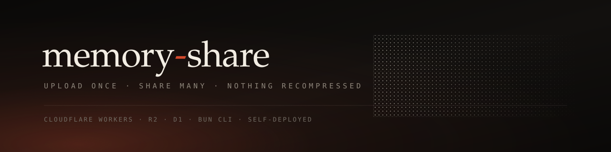

[](https://bun.sh)
[](https://www.typescriptlang.org)
[](https://nextjs.org)
[](https://developers.cloudflare.com/workers/)
[](LICENSE)

Share a holiday's worth of photos and video with one person, at full
resolution, from your own Cloudflare account.

I built this because every messenger recompresses what you send. Signal,
WhatsApp and iMessage all re-encode a 4K clip into something smaller and worse,
and there is no setting that stops them. The alternative — a cloud drive — hands
your holiday to a company and gives your friend a download manager instead of a
gallery. memory-share is the third option: your bytes, your account, a link and
a password, and what comes down the wire is byte-identical to what came off the
phone.

> **Status: in development.** The CLI, the share-side web app and the owner API
> are built and independently tested; end-to-end wiring, a real-corpus
> migration and the security audit are outstanding. Not yet tagged. Read
> [docs/CONTRACT.md](docs/CONTRACT.md) before depending on anything here.

## 1. The idea

Most photo sharing conflates two things this system keeps apart:

- an **asset** is bytes in R2, addressed by the sha256 of the original,
- a **memory** is a curated, password-protected album that *references* assets.

Deleting a memory deletes the album, never the bytes. So you can upload a
terabyte once, and cut any number of shares out of it:

```
                         ┌─────────────────────────────┐
  ms upload ~/croatia    │  asset pool  (R2 + D1)      │
  ms upload ~/turkey ───▶│  content-addressed, tagged  │
                         └───────┬─────────────┬───────┘
                                 │             │
              ┌──────────────────┘             └───────────────┐
              ▼                                                ▼
   "Best holidays ever"                            "2 best holidays"
   everything tagged #croatia                      5 from #croatia
                                                 + 5 from #turkey
              │                                                │
              ▼                                                ▼
     /m/best-holidays-ever                         /m/2-best-holidays
     link + password                                link + password
```

The same photograph appears in both albums and is stored exactly once. Deleting
either album touches nothing but a join table. Tags, not folders, are what make
that second album a query rather than a copy.

## 2. What you download is what you shot

The promise is narrow and absolute: **`orig/` objects are written once and never
modified**, and the download button serves them unaltered.

Browsers, however, cannot render HEIC and mostly cannot play HEVC — which is
most of an iPhone library. So every asset also has a browser-renderable
rendition, and the two never get confused:

| | viewing | downloading |
|---|---|---|
| photo | Images transform of the original, at read time | the original |
| video | locally-encoded 1080p H.264 proxy | the original |

Your friend watches a proxy and keeps the real file.

## 3. Where the work happens

| stage | runs | why |
|---|---|---|
| hashing, video transcode, oversize-photo renditions | **your machine**, via the CLI's bundled ffmpeg | the heavy work, where the footage already is |
| photo thumbnails and view renditions | **the edge**, Cloudflare Images binding | free at this scale, stores nothing, reads a private bucket |
| storage and serving | **your Worker** | pure storage-and-serving: no queue, no containers, no transcoding |

The deployed side is deliberately dumb. There is no background job to fail, no
queue to drain, nothing to keep warm. It costs R2 storage and very little else.

## 4. Quickstart

```bash
bun add -g memory-share

ms login                       # Cloudflare token, stored 0600
ms deploy                      # creates R2 bucket, D1, secrets, deploys — idempotent

ms upload ~/Pictures/croatia --tag croatia
ms upload ~/Pictures/turkey  --tag turkey

ms memory create "Best holidays ever" --tag croatia
#   https://your.worker.dev/m/best-holidays-ever
#   password: harbor-cliff-meadow-anchor-ember

ms memory create "2 best holidays" --pick a1b2c3,d4e5f6,...
```

`ms deploy` provisions into **your** account and is safe to re-run — it detects
existing resources and reuses them.

## 5. Uninstalling leaves nothing

ffmpeg ships as platform-specific optional dependencies resolved from
`node_modules`, never downloaded into `~/.cache` or `/tmp`. Removing the package
removes the binaries with it. The only thing a plain uninstall leaves behind is
the config directory:

```bash
ms uninstall          # removes ~/.config/memory-share too
bun remove -g memory-share
```

## 6. Security posture

- One password per memory, PBKDF2-hashed; generated passwords are five random
  dictionary words (~79 bits), because rate limiting on Cloudflare's binding is
  eventually consistent and therefore a speed bump, not a wall.
- Session cookies are HMAC-signed and **scoped to a single memory** — unlocking
  one album grants nothing on another, and a media key from one is a 404 in the
  other.
- The R2 bucket has no public URL and no presigned surface. Every byte is
  served through the Worker, behind the cookie for that exact memory.
- `allow_download = 0` is a control, not a hint: no failure path may fall back
  to serving original bytes on a memory that withholds them.
- Media responses are `private, no-cache` so a locked session cannot replay
  from browser cache.

Full detail, including what is *not* protected, in [docs/SECURITY.md](docs/SECURITY.md).

## 7. Documentation map

| file | what it is |
|---|---|
| [docs/CONTRACT.md](docs/CONTRACT.md) | the API and storage contract every part builds against |
| [db/migrations/](db/migrations/) | schema, heavily commented |
| [packages/cli/](packages/cli/) | the `ms` CLI |
| [apps/web/](apps/web/) | Worker: share pages, share API, owner API |

## 8. License

MIT. See [LICENSE](LICENSE).
